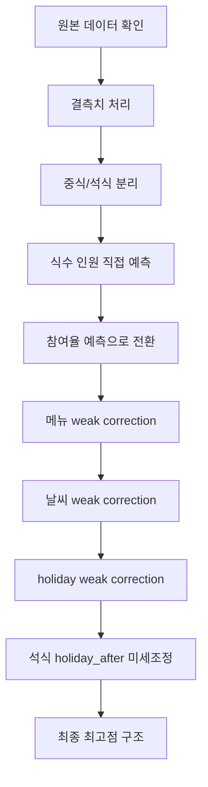
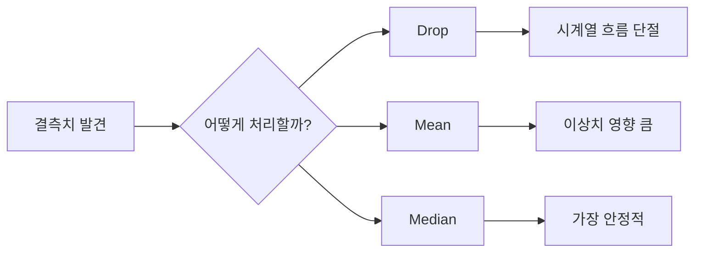
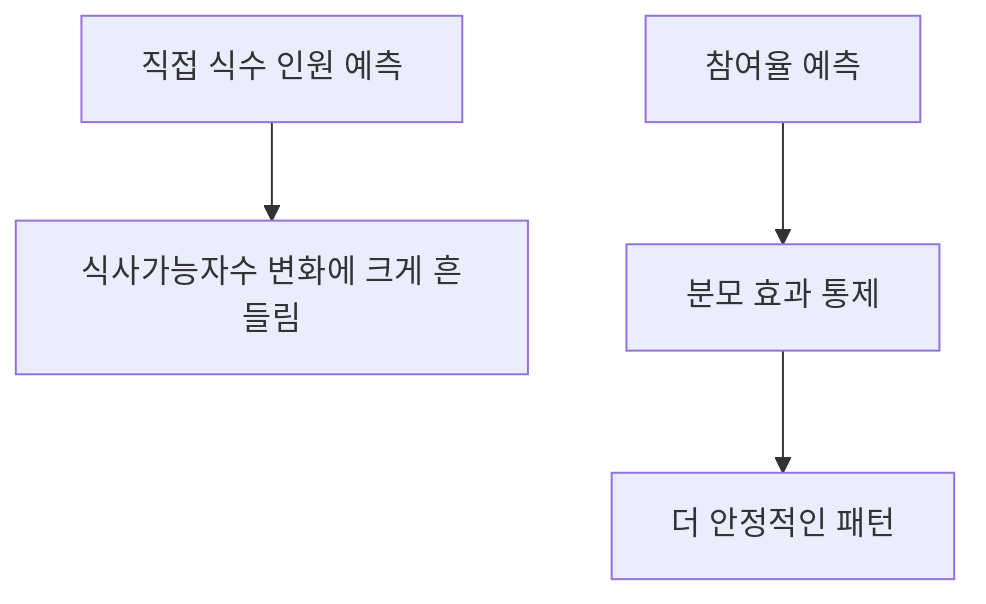
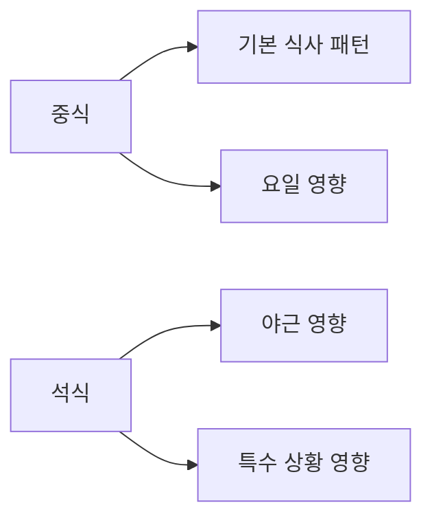
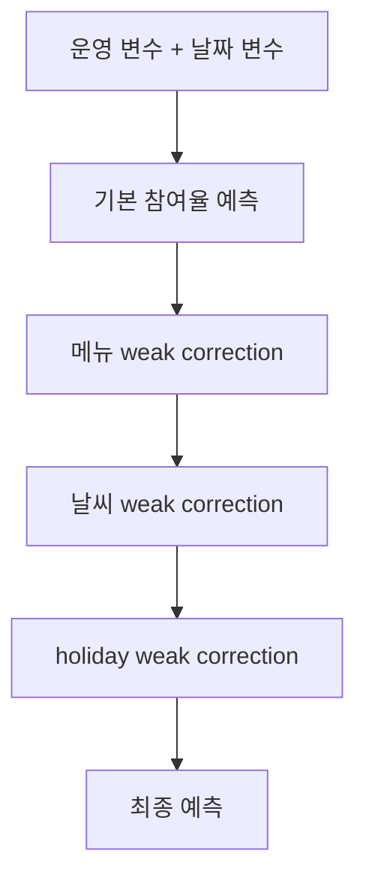
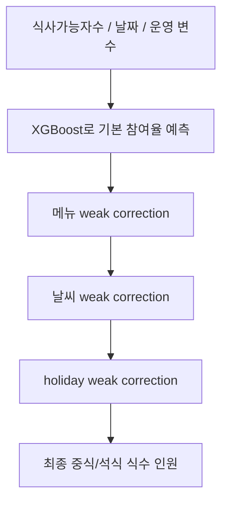

# 구내식당 식수 인원 예측 프로젝트  
### 오늘 뭐나오조 팀 발표용 README (시각화 포함)

> **한 줄 요약**  
> 저희는 구내식당의 **중식/석식 식수 인원**을 예측하기 위해,  
> **참여율(rate) 기반 예측 + 메뉴/날씨/연휴 weak correction** 전략을 사용했습니다.

---

## 1) 프로젝트 목표

저희 모델의 목적은 다음과 같습니다.

- **요일별 점심/저녁 식수 인원 예측**
- 잔반과 원가 낭비를 줄일 수 있는 의사결정 보조
- 구내식당 운영 최적화

### 평가 기준
- 예측값과 실제값의 차이를 보는 **MAE**
- **점수가 낮을수록 더 좋은 모델**

---

## 2) 문제를 쉽게 설명하면

이 프로젝트는 단순히  
**“오늘 몇 명이 밥을 먹을까?”**를 맞추는 문제가 아닙니다.

실제로는 다음 같은 요소가 함께 작용합니다.

- 오늘 **출근한 사람이 몇 명인지**
- **휴가/출장/재택** 때문에 식사 가능한 사람이 몇 명인지
- **점심인지 저녁인지**
- **날씨가 어떤지**
- **연휴 전후인지**
- 메뉴가 평소보다 **선호될 가능성**이 있는지

즉 이 문제는 숫자 예측인 동시에,  
**직장인의 행동 패턴을 예측하는 문제**라고 볼 수 있습니다.

---

## 3) 전체 진행 흐름

### 이 흐름이 의미하는 것
- 처음부터 완벽한 모델을 만든 것이 아니라,
- **가설 → 실험 → 점수 확인 → 수정**
를 반복하면서 점진적으로 개선했습니다.

---

## 4) 데이터 소개

주어진 데이터는 약 **1,200일**의 일자별 기록입니다.

### 주요 컬럼
- 본사정원수
- 본사휴가자수
- 본사출장자수
- 현본사소속재택근무자수
- 본사시간외근무명령서승인건수
- 중식메뉴
- 석식메뉴
- 중식계
- 석식계

### 예측 타겟
- **중식계**
- **석식계**

### 시각화: 요일에 따라 식수 패턴이 다름

- 이 그래프는 **월~금 요일별 평균 식수 차이**를 보여줍니다.
- 즉, 요일만 달라도 식수 패턴이 다르기 때문에 날짜 정보가 중요하다는 뜻입니다.

---

## 5) 왜 외부 데이터(날씨)를 가져왔나?

직장인이 구내식당을 이용할지 말지는  
단순히 회사 내부 변수만으로 설명되지 않는 경우가 있습니다.

예를 들면:

- 비가 오면 밖에 나가 먹기 귀찮을 수 있음
- 너무 덥거나 추우면 이동이 줄어들 수 있음
- 그래서 구내식당 이용률이 달라질 수 있음

### 저희의 가설
> “날씨는 구내식당 이용에 영향을 주는 심리적 요인일 수 있다.”

그래서 **기온 / 강수량**을 추가로 붙였습니다.

### 시각화: 비 오는 날의 평균 식수

- 날씨가 식수 전체를 뒤집는 수준은 아니지만,
- **행동을 조금 흔드는 보조 신호**라는 점을 보여줍니다.
- 그래서 날씨는 direct feature보다 **weak correction**으로 쓰는 게 더 잘 맞았습니다.

---

## 6) 결측치 처리: 왜 Drop이 아니라 Median이었나?

### 고민한 방식
- Drop
- Mean
- Median

### 최종 선택
- **Median(중앙값)**

### 이유
- 이 데이터는 시계열 흐름이 있습니다.
- 특정 날짜를 Drop하면 흐름이 끊깁니다.
- 평균(mean)은 튀는 값(outlier)에 끌려갑니다.
- 중앙값(median)은 특수한 날의 영향을 덜 받습니다.

### 핵심 해석
- **Drop은 흐름을 깨고**
- **Mean은 튀는 값에 흔들리며**
- **Median은 가장 안정적**이었습니다.

---

## 7) 핵심 전략 1: 타겟 재정의 (참여율)

처음에는 식수 인원 자체를 직접 맞추려 했습니다.

즉:
- 오늘 중식 몇 명?
- 오늘 석식 몇 명?

하지만 이 방식은 **식사가능자수의 변화**에 너무 많이 흔들렸습니다.

### 그래서 바꾼 방식
먼저 **참여율**을 예측했습니다.

\[
참여율 = rac{실제 식수 인원}{식사가능자수}
\]

### 식사가능자수란?
> 본사정원수 - 휴가자 - 출장자 - 재택근무자

즉 실제로 식사할 수 있는 사람 수를 의미합니다.

### 왜 참여율이 더 좋았나?
- 절대 인원은 날마다 분모가 달라 흔들립니다.
- 참여율은 “가능한 사람 중 몇 %가 먹는가”를 보므로 더 안정적입니다.

### 시각화: 식사가능자수와 중식계 관계

- 식사가능자수가 커질수록 중식계도 커지는 경향이 보입니다.
- 하지만 완전히 같은 비율로 늘지 않기 때문에,  
  **절대 인원보다 참여율 관점이 더 안정적**이었다고 해석할 수 있습니다.
---

## 8) 핵심 전략 2: 중식과 석식을 분리

처음에는 중식과 석식을 비슷하게 다루려는 접근도 있었습니다.  
하지만 실제로는 움직이는 이유가 달랐습니다.

### 중식
- 기본적인 식사 수요
- 요일 영향 큼

### 석식
- 야근 여부 영향 큼
- 연휴 직후 복귀 패턴 영향 큼

### 핵심 해석
> 중식과 석식은 **같은 문제처럼 보여도 다른 문제**였습니다.

그래서 중식 모델 / 석식 모델을 분리했습니다.

### 시각화: 석식과 야근의 관계

- 야근이 많을수록 석식계가 늘어나는 경향을 볼 수 있습니다.
- 석식은 중식보다 **야근 영향이 더 직접적**이어서 분리하는 것이 자연스러웠습니다.

### 시각화: 야근 구간별 평균 석식참여율

- 야근이 많아질수록 석식 인원뿐 아니라 **석식 참여율**도 달라집니다.
- 즉 석식은 정말로 **운영 조건**에 민감한 타겟이었다고 볼 수 있습니다.

---

## 9) 핵심 전략 3: Weak Correction

처음에는 메뉴나 날씨를 모델 안에서 무겁게 학습시키려 했습니다.  
하지만 데이터 수가 많지 않아서 오히려 과적합이 생겼습니다.

그래서 방향을 바꿨습니다.

### 핵심 아이디어
1. 먼저 **기본 참여율 모델**을 만든다.
2. 그 다음 **메뉴 / 날씨 / 연휴 신호를 약하게만 보정**한다.

즉,
- 기본 뼈대는 강하게
- 행동 신호는 가볍게

### 왜 이 방식이 좋았나?
- 메뉴, 날씨, 연휴는 “주연”이 아니라 “조연”에 가까웠습니다.
- 모델 내부에서 무겁게 학습시키는 것보다
- **결과를 조금 조정하는 방식**이 더 잘 맞았습니다.

---

## 10) 메뉴는 왜 약하게 넣었나?

메뉴는 분명 영향을 줍니다.  
하지만 메뉴 데이터는 텍스트라서 직접 학습시키면 feature 수가 너무 많아집니다.

그래서 저희는 메뉴를 직접 강하게 넣는 대신,
- 중식: 핵심 키워드
- 석식: 메뉴 스타일

같은 **가벼운 신호**로 만들고,  
그걸 **weak correction** 형태로만 사용했습니다.

### 쉽게 말하면
> “이 메뉴가 있으면 평소보다 조금 더 먹을 수도 있겠다”  
정도의 약한 보정으로 반영한 것입니다.

### 시각화: 중식 핵심 메뉴 효과

- 치킨, 돈까스, 제육처럼 상대적으로 선호될 수 있는 메뉴가 있는 날에는
- 평균 중식계나 참여율이 달라지는 경향이 있습니다.
- 다만 이 차이가 매우 압도적이지는 않아서,
- **직접 강한 입력이 아니라 약한 보정 신호**가 더 적절했습니다.

### 시각화: 석식 메뉴스타일 효과

- 석식도 중식처럼 메뉴 스타일에 따라 차이가 생기지만,
- 이것 역시 **기본 예측을 살짝 흔드는 수준**으로 해석하는 것이 더 자연스러웠습니다.

---

## 11) 날씨는 왜 약하게 넣었나?

처음에는 저희도  
“비가 오면 식수가 많이 늘겠지?”  
라고 생각했습니다.

그런데 실제 데이터를 보면  
비 오는 날과 안 오는 날의 차이가 **생각보다 크지 않았습니다.**

즉 날씨는
- 매우 강한 주력 변수는 아니고
- 사람 행동을 **조금 흔드는 보조 신호**

였습니다.

그래서 날씨도 weak correction 방식으로 쓰는 것이 더 유리했습니다.

---

## 12) holiday는 왜 중요했나?

반면 **연휴 전후**는 꽤 뚜렷한 차이를 보였습니다.

- 연휴 직전: 외부 약속, 조기 퇴근, 들뜬 분위기
- 연휴 직후: 복귀 패턴, 다시 회사 루틴으로 돌아옴

특히 저희 실험에서는  
**석식이 holiday_after에 가장 민감하게 반응**했습니다.

즉:
> 석식은 연휴 직전보다, 연휴 직후 첫 근무일 패턴이 더 중요했습니다.

### 시각화: 연휴 전/후 평균 식수

- 연휴 전후의 평균 식수가 일반일과 다르게 나타납니다.
- 그래서 holiday 신호를 correction으로 넣는 것이 효과적이었습니다.

---

## 13) 모델 선택: 왜 XGBoost였나?

저희는 딥러닝이나 무거운 앙상블보다  
**XGBoost 단일 모델**을 최종적으로 선택했습니다.

### 이유
- 데이터가 표 형태(tabular)입니다.
- 샘플 수가 아주 크지 않습니다.
- 변수 간 비선형 관계는 있지만,
  이미지/문장처럼 거대한 비정형 데이터는 아닙니다.

이럴 때는 딥러닝보다  
**XGBoost가 더 안정적이고 과적합을 잘 막아줍니다.**

### 한 줄 요약
> 이번 문제는 “복잡한 모델이 필요한 문제”보다  
> “데이터 성격에 맞는 모델을 고르는 문제”에 더 가까웠습니다.

---

## 14) 점수 개선 흐름

아래는 실제 성능이 좋아졌던 핵심 단계입니다.

| 단계 | 핵심 변화 | 점수 |
|---|---|---:|
| 운영 비율형 변수 추가 | 절대값보다 비율 신호 반영 | 73.7161 |
| 메뉴를 가벼운 신호로 반영 | keyword/style 기반 | 73.8647 |
| 메뉴 weak correction | 메뉴를 보정층으로 사용 | 71.3722 |
| 날씨 weak correction | 비/더위/추위를 약한 보정으로 사용 | 69.3488 |
| holiday weak correction | 연휴 전/후 신호 추가 | 68.7557 |
| holiday_dinner_stronger | 석식 holiday 강도 강화 | 68.3199 |
| holiday_dinner_after_stronger | 석식 holiday_after 강화 | 68.1637 |
| holiday_after = +0.005 | 최종 미세조정 | **68.0076** |

### 시각화: 실제 점수 개선 그래프

- 개선이 한 번에 일어난 것이 아니라,
- 작은 가설 검증이 반복되면서 점진적으로 점수가 내려간 것을 볼 수 있습니다.

---

## 15) 최종 구조를 아주 쉽게 말하면

저희의 최종 구조는 이렇습니다.

즉,
- 기본 예측은 단단하게 만들고
- 사람 행동과 관련된 신호는 약하게 보정했습니다.

---

## 16) 얻은 점 / 느낀 점

### 1. 전처리는 생각보다 훨씬 중요했다
처음에는 모델에 더 집중했지만,  
결국 성능을 끌어올린 것은 전처리와 feature engineering이었습니다.

### 2. 문제 정의를 바꾸면 성능이 크게 달라질 수 있다
식수 인원을 직접 맞추는 대신  
참여율로 바꾼 것이 큰 전환점이었습니다.

### 3. 도메인 지식은 강력하다
비, 연휴, 야근, 메뉴 선호도처럼  
일상적인 직장인의 행동 감각이 실제로 모델 성능 개선에 도움이 되었습니다.

### 4. 복잡한 모델이 항상 답은 아니다
이번 프로젝트에서는  
더 복잡한 딥러닝보다  
**가볍고 해석 가능한 구조**가 더 잘 맞았습니다.

---